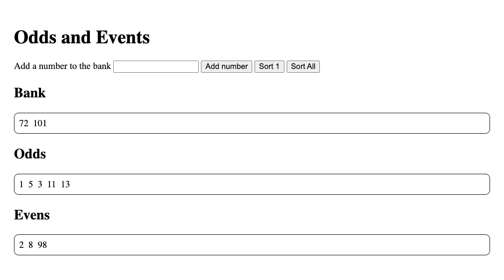

# Odds and Events

The goal of this workshop is to create an app that allows a user to input a number into a number bank. The user can then sort the numbers in the bank into one of two categories: odd or even.

## Requirements

For this workshop, you'll be starting from scratch! You are highly encouraged to reference previous solutions. Write JS to build an application that meets the following requirements:

- `index.html` is not modified. All elements are generated via JS.
- The application contains a form that allows users to input a number.
- When the user clicks the "Add number" button, the number they entered into the input field should be added to the number bank.
- The number bank should display all of the numbers that the user has entered.
- When the "Sort 1" button is clicked, the first number in the number bank is removed and placed into either the odd or even category.
- When the "Sort All" button is clicked, all numbers in the number bank are moved into either the odd or even category.
- Numbers are moved into the correct category based on whether they are odd or even.
- The numbers in the bank, odd category, and even category are stored as state variables.
- Functions are used to organize logic involving state changes.
- The application is rerendered whenever state changes.
- UI elements are organized into component functions.
- Event listeners modify state. They do not directly modify the document.

## Extensions

If you're done early, try to implement one or more of the following features:

- Add a button that generates a random number into the number bank.
- Refactor the user input field so they can enter a string of comma-separated numbers.
- Add a way for users to choose how many numbers they want to sort at a time.
- Within each category, sort the numbers in ascending order.
- Add a dropdown that allows users to toggle whether the numbers are sorted in ascending or descending order.

## Submission

Please submit the link to your public GitHub repository.
